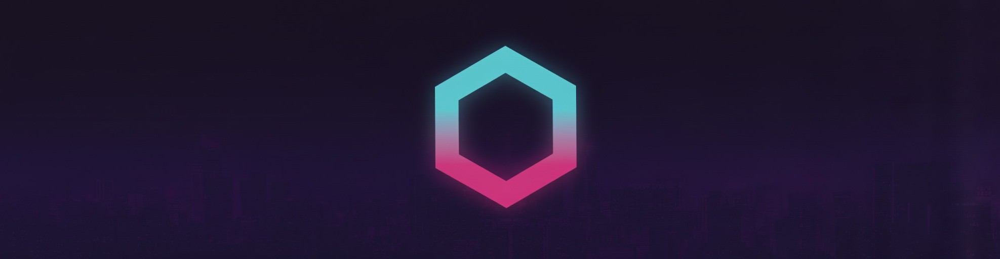
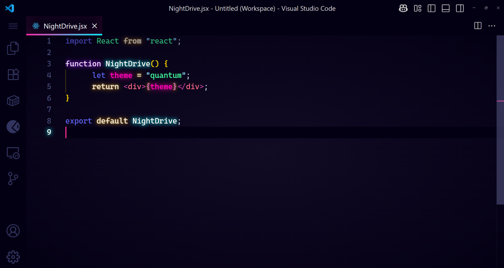

# Quantum SynthWave - VS Code theme

I loved SynthWave '84 for the Neon colors, but I felt like it didn't fit me and decided to use a completely different color palette, something I felt more comfortable with. I would love to be able to show you what I did like.

**theme**

Command Palette with Ctrl + Shift + P or Shift + ⌘ + P and select "**Enable Neon Dreams**

Command Palette with "Ctrl + Shift + P" or "Shift + ⌘ + P" and selecting "**Disable Neon Dreams**"

## Installation

To begin with, [install the base theme from the VS Marketplace](https://marketplace.visualstudio.com/items?itemName=GatomontesRoselll.quantum-vscode). This is the way Synthwave '84 is intended to be used day-to-day. If you want to enable the gratuitous 80s glow, it needs a little extra work to get it going.

### Disclaimer

VS code doesn't natively support text effects and as a result, the glow is experimental. It's likely to be buggy and, whilst it looks rad, it isn't intended for extended use. To enable the glow, the extension has to modify the internal files of VS Code, so use with caution. Should something go wrong, you can disable the glow by following the instructions below. If for any reason you can't open VS Code, you can fix the issue with a fresh install of VS Code.

If you do decide use the glow effect, you do so at your own risk. Bring your Sunglasses. Here be (laser)dragons.

### Font

I haven't included any fonts in this version, as I know it's a very personal preference. The font I use (seen in the image above) is [Cascadia Code], which I recommend if you like ligatures.

## Contributions

I'll gladly consider any contributions to this theme. Before making any changes, please read the contribution guidelines.

## Thanks

Finally, I couldn't have done this without the fantastic work of Sarah Drasner. Her CSS tricks tutorial for the theme was a huge help in its development. 🙏

I also want to thank Wes Bos for his fantastic Cobalt2 theme. Your readme helped me figure out how to package this mess for public use. 👍

If this theme is too much for you, I recommend Horizon or City Lights for a similar, but more understated, retro style. Both are gorgeous.

Cityscape banner image from Unsplash.
